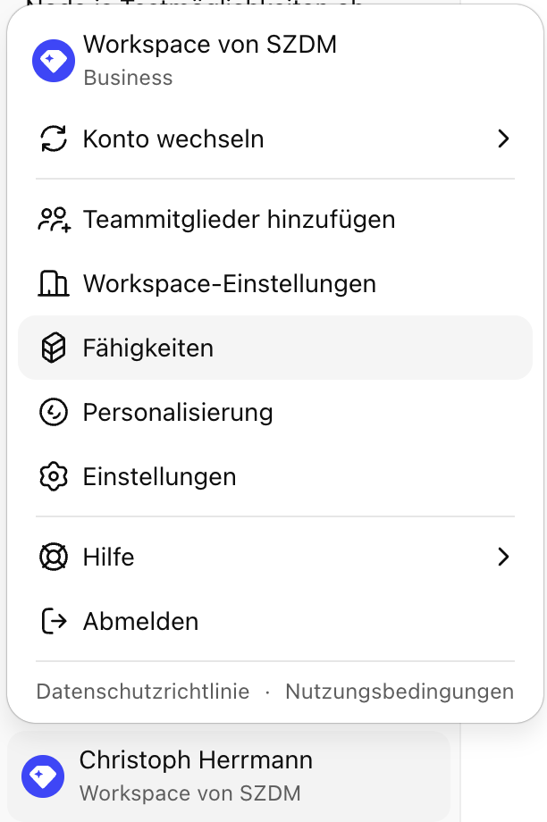
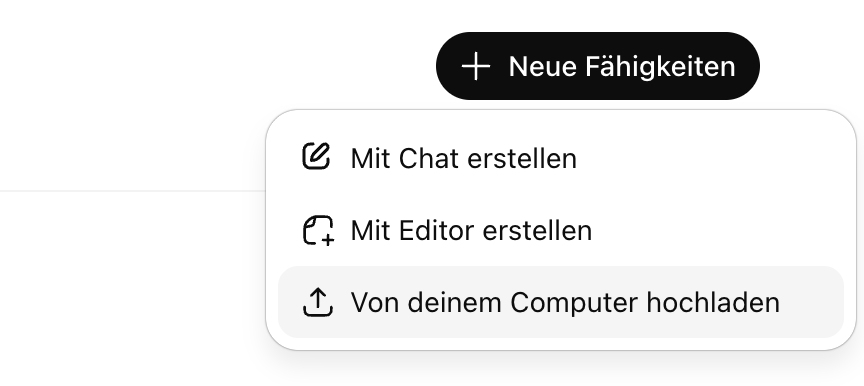
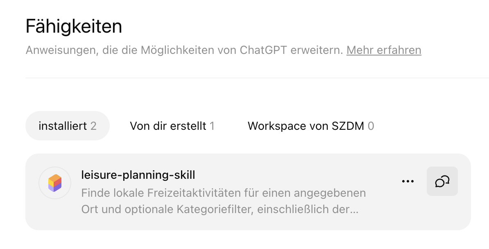
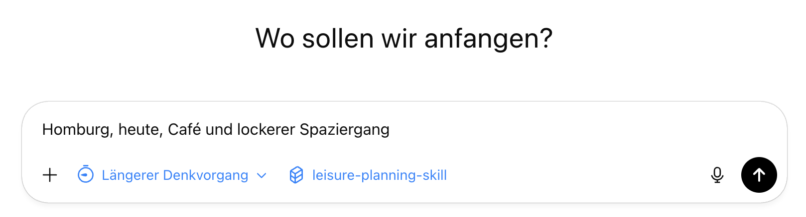

# Leisure Planning Skill

Finde lokale Freizeitaktivitäten für einen angegebenen Ort und optionale Kategoriefilter, einschließlich der Verfügbarkeit für einen bestimmten Tag und eine bestimmte Uhrzeit. Geeignet für strukturierte Empfehlungen zu Cafés, Spaziergängen, Restaurants, Aktivitäten und ähnlichen lokalen Angeboten mit praktischen Details wie Parkmöglichkeiten, Fußwegentfernung, Öffnungszeiten, Kosten, Adresse und Homepage.

## Installation

### ChatGPT

1. Gehe im Browser im Web Chat von ChatGPT links unten auf dein Profil -> "Fähigkeiten"

2. Auf dieser Seite dann rechts oben auf "Neue Fähigkeiten" -> "Von deinem Computer hochladen"

3. Ziehe die [SKILL.zip](SKILL.zip) Datei aus dem Ordner hier in das Feld

## Verwendung

### ChatGPT

1. Gehe im Browser im Web Chat von ChatGPT links unten auf dein Profil -> "Fähigkeiten"

2. Gehe beim Skill "leisure-planning-skill" auf das Chat Symbol

3. Entferne das Prompt und gebe mindestens einen Ort und optional auch an wann du was machen willst

